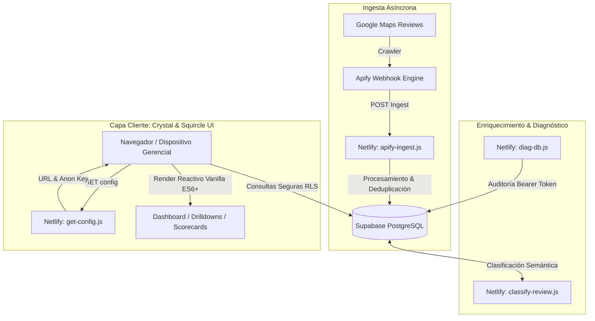

# 🌟 Étoile Dashboard · Hospitality Customer Intelligence & Operations
> **Plataforma Integral de Analítica de Reseñas, Detección de Fricciones en Servicio y Auditoría Operativa Multi-Sucursal para Hospitalidad y Restauración.**

[](#)
[](#)
[](https://supabase.com)
[](https://apify.com)
[](#)

---

## 🧭 Visión General

**Étoile Dashboard** es una solución de Business Intelligence orientada al sector de la hospitalidad y gastronomía retail. Transforma miles de opiniones y calificaciones públicas de Google Maps en tableros operacionales accionables, permitiendo a directores de operaciones y gerentes de sucursal:
- Detectar caídas inmediatas en el NPS y calidad de atención.
- Categorizar automáticamente las quejas en tres ejes críticos: **Servicio / Atención**, **Calidad de Producto** y **Percepción de Valor / Precio**.
- Monitorear en tiempo real el tiempo de respuesta ante reseñas negativas desatendidas.
- Auditar métricas históricas comparativas mes a mes y trimestre a trimestre.

---

## 🏛️ Arquitectura del Sistema

La arquitectura está concebida bajo un modelo **Zero-Secret Client / Jamstack Serverless**, donde el frontend estático jamás expone llaves maestras y delega la orquestación y enriquecimiento de datos a Netlify Functions y Supabase:



---

## ⚡ Capacidades Principales

1. **Scorecards Operativos y Umbrales Críticos**:
   - Mapeo visual de estado de sucursales según rangos de desempeño: *Sobresaliente* (≥4.80), *Objetivo Regional* (4.60-4.79) y *Crítico* (<4.30).
2. **Motor de Clasificación de Fricciones**:
   - Pipeline de categorización heurística y semántica que aísla palabras clave de quejas (`servicio`, `calidad`, `valor`) reconociendo negaciones y contexto.
3. **Drill-Down de Sucursal**:
   - Vistas detalladas por unidad de negocio con análisis de palabras frecuentes del equipo, colaboradores mencionados y tendencias temporales.
4. **Seguridad y Resiliencia**:
   - Autenticación con Supabase Auth y persistencia segura en cookies.
   - Acceso a endpoints diagnósticos protegido vía `Bearer DIAG_SECRET`.

---

## 🛠️ Stack Tecnológico

- **Frontend**: Vanilla JavaScript (ES6+ modular), HTML5 Semántico, CSS3 Custom Properties (Crystal & Squircle Design System, Giaza Typography).
- **Serverless Compute**: Netlify Functions (Node.js 18+ runtime).
- **Base de Datos & Auth**: Supabase (PostgreSQL, Row Level Security, Realtime).
- **Data Pipelines**: Apify Actor Tasks & Webhook endpoints.

---

## 🚀 Despliegue y Configuración Local

1. Clona el repositorio:
   ```bash
   git clone https://github.com/ultimaibrahim/etoile-dashboard.git
   cd etoile-dashboard
   ```
2. Configura las variables de entorno en Netlify o en tu archivo `.env`:
   ```bash
   cp .env.example .env
   ```
3. Llena los valores correspondientes en `.env`:
   - `SUPABASE_URL`: URL del proyecto en Supabase.
   - `SUPABASE_ANON_KEY`: Clave pública anon de Supabase.
   - `SUPABASE_SERVICE_ROLE_KEY`: Clave de servicio para funciones administrativas.
   - `APIFY_TOKEN`: Token para la API de Apify.
   - `DIAG_SECRET`: Token para endpoints de auditoría.
4. Ejecuta localmente con Netlify CLI:
   ```bash
   npm install -g netlify-cli
   netlify dev
   ```

---

## 👨‍💻 Autor & Arquitectura

Diseñado y construido por **Ibrahim García** ([@ultimaibrahim](https://github.com/ultimaibrahim)) · Guadalajara, México.